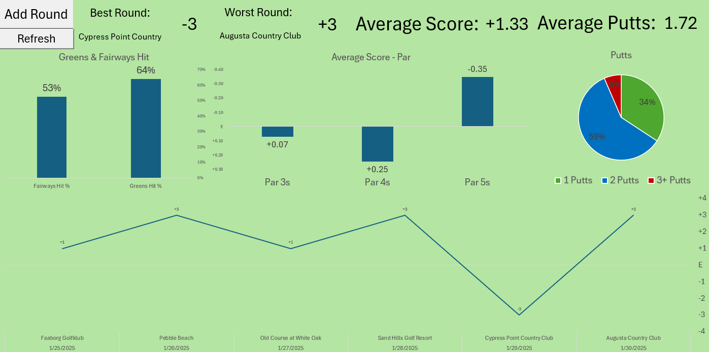
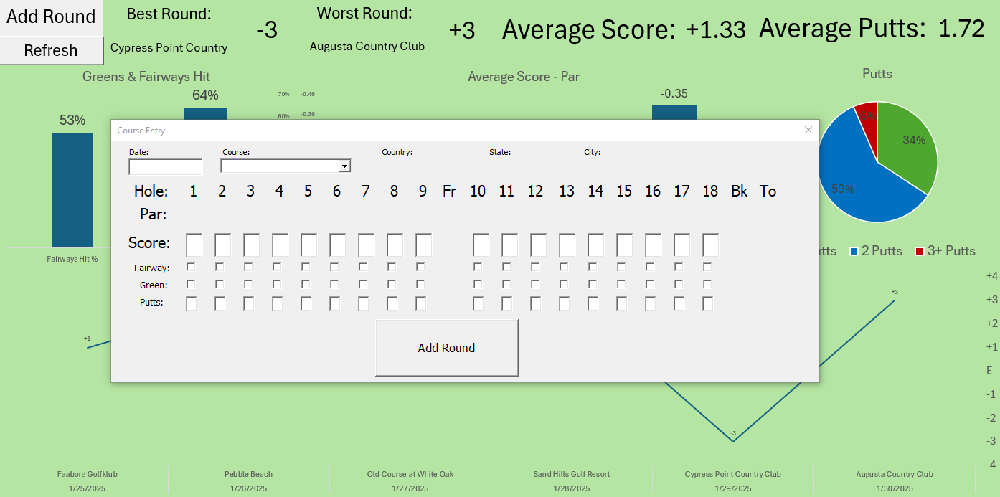
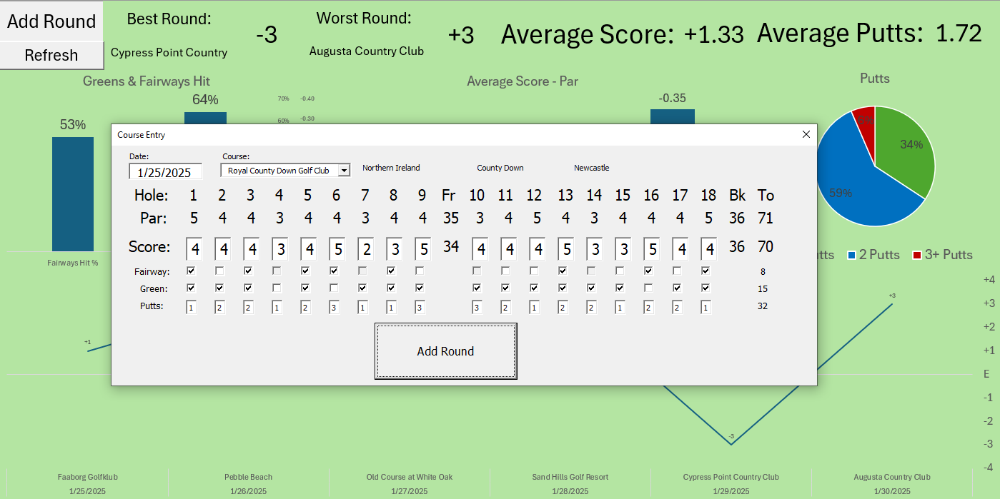

# ⛳ Excel Dashboard for Golfers ⛳

An easy way to enter, store and and visualize your golf results!

## Features
- A comprehensive database of **17,000+ courses** (scraped from the web)
- Easy-to-use **GUI (Excel form)** for entering user results (score, greens, fairways hit, and putts)
- Results automatically entered into an **Excel sheet database**
- **Dynamic dashboard** displaying historical results via Pivot tables and macros

---

## How to Use

### *Note: You must allow Excel macros for `.xlsm` files to execute properly.*

1. **Download** the `Golf_Dashboard.xlsm` file located in the `dashboards` folder.
2. **Open** the file in Excel and enable macros.
3. On the **Dashboard** sheet, locate the two buttons in the top left corner:
   - **"Add Round"** - Opens the user form interface.
   - **"Refresh"** - Updates the stats and visuals on the sheet.

  

### Entering a Round

1. Click **"Add Round"** to open the user form interface.
2. Enter a valid **date** in the entry box (e.g., `M/D/YY`, `MM/DD/YYYY`).

  

3. **Select a course** by typing its name in the "Course" entry box.
   - The country/state/city and par scores will auto-populate.
   - If your course isn’t listed, see [modifying the course database](#modifying-the-course-database).
4. **Enter your scores** in the labeled columns:
   - Score
   - Greens hit
   - Fairways hit (*not applicable for par 3s*)
   - Putts
   - *If the course has only 9 holes, leave the back 9 empty.*
5. Click **"Add Round"** in the form.
   - A confirmation message will appear—click **OK**.
6. Click **"X"** in the form window to exit.
7. Click **"Refresh"** on the dashboard to update statistics.

  

---

## Modifying the Course Database

The **17,000+ course database** is in the **"Course Database"** sheet.

### Adding a New Course
1. Select the `Course Database` sheet. 
2. Navigate to the **bottom of the course table**.
   - *Tip:* Press `Ctrl + Space` to quickly select the last row, then click the cell below it.
3. **Enter your course details** following the format of existing entries.
   - *For courses with fewer than 18 holes:*
     - Mark remaining holes as **0** (e.g., for a 9-hole course, back 9 should be `0`).
     - Ensure the **"back"** column is `0`.
     - The **total** column should match the front 9.

---

## Modifying the Score Database

> **⚠ NOTICE:** The first row in the scores table is **hidden** and contains necessary formulas. **Do NOT remove it.**

### Editing an Existing Round
- You can modify **any columns LEFT of column 93 (Score1)** without affecting dashboard logic.
- **Columns 93-122** contain formulas that should not be altered.
- Changing a course's details in the database **may cause inconsistencies** in historical data.

### Removing a Round
1. **Select the row** containing the round to delete.
2. **Right-click** the row number and select **"Delete"**.
3. **Verify** the row is empty.
4. Click anywhere in the **score table**.
5. Go to **Table Design** in Excel.
6. In the **top-left**, check that the **Table Name** is `scoreDatabase`.
7. Click **Resize Table**, then **adjust the table range**.
   - *If removing all courses, ensure Row 2 is included in the adjusted table range.*

---
 Happy golfing! 🏌️‍♂️

